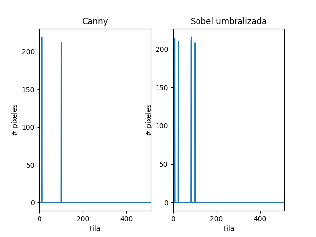
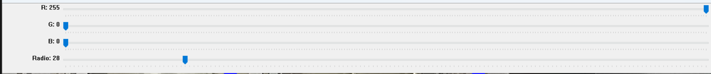

# Visión por Computador - Práctica 2

Esta práctica ha consistido en realizar una serie de tareas con el objetivo de adquirir la capacidad de utilizar OpenCV para manejar utilidades de conversión de espacio de color, cálculo de bordes o contornos, umbralizado, histogramas, diferencias de fotogramas o sustracción de fondo, etc.

## TAREA 1: Realiza la cuenta de píxeles blancos por filas (en lugar de por columnas). Determina el valor máximo de píxeles blancos para filas, maxfil, mostrando el número de filas y sus respectivas posiciones, con un número de píxeles blancos mayor o igual que 0.95*maxfil.
Para realizar esta tarea se ha utilizado la función reduce con el parámetro dim a 1 para sumar los píxeles por fila[^1] y normalizado el resultado. Tras esto se ha obtenido el valor máximo y cambiado a 0 todas las filas que no superan el 95% de ese valor, mostrando el resultado como de la siguiente imagen.

## TAREA 2: Aplica umbralizado a la imagen resultante de Sobel (convertida a 8 bits), y posteriormente realiza el conteo por filas y columnas similar al realizado en el ejemplo con la salida de Canny de píxeles no nulos. Calcula el valor máximo de la cuenta por filas y columnas, y determina las filas y columnas por encima del 0.95*máximo. Remarca con alguna primitiva gráfica dichas filas y columnas sobre la imagen. ¿Cómo se comparan los resultados obtenidos a partir de Sobel y Canny?
Para realizar esta tarea se ha aplicado el umbralizado con la función threshold con valor 100 a la imagen de Sobel convertida a 8 bits y repetido el proceso de la anterior tarea, obteniendo los siguientes resultados.

En el resultado obtenido se observa que el conteo en las filas produce resultados similares en cuanto la posición y nº de píxeles, habiendo más filas en Sobel umbralizada que superan 95% maxfil.
En el conteo en las columnas se observa un mayor nº de columnas que superan 95% maxcol en canny y nº de píxeles ligeramente mayor en cada columna en Sobel umbralizada.

## TAREA 3: Proponer un demostrador que capture las imágenes de la cámara, y les permita exhibir lo aprendido en estas dos prácticas ante quienes no cursen la asignatura :). Es por ello que además de poder mostrar la imagen original de la webcam, incluya al menos dos usos diferentes de aplicar las funciones de OpenCV trabajadas hasta ahora.
Esta tarea se divide en tres modos que se activan leyendo la presión de teclas. El primero simplemente muestra la imagen de la camara.

El segundo permite dibujar rectángulos y círculos sobre la imagen. Para ello se crea un lienzo donde se guarda los cambios a la imagen de la camara y para aplicarlos a la misma se crea una máscara a partir del canal alfa del lienzo con la función threshold, se aplica a la imagen de cámara con bitwise_and y añaden los colores del lienzo con bitwise_or.

El tercer modo muestra la imagen de la cámara aplicando los filtros de canny, Sobel a 8-bits y umbral.

## TAREA 4: Tras ver los vídeos [My little piece of privacy](https://www.niklasroy.com/project/88/my-little-piece-of-privacy), [Messa di voce](https://youtu.be/GfoqiyB1ndE?feature=shared) y [Virtual air guitar](https://youtu.be/FIAmyoEpV5c?feature=shared) proponer un demostrador reinterpretando la parte de procesamiento de la imagen, tomando como punto de partida alguna de dichas instalaciones.
La propuesta consiste en detectar un color en la imagen de la cámara e invertirlos los píxeles que se encuentren. Para ello se utilizó el espacio de color HSV, que nos permite poder representar el color como un rango de valores dentro del canal de matiz del espacio facilitando la detección del mismo mediante la técnica de umbralizado.

Fuente de la imagen[^2]

Se proporciona un widget para determinar el rango del umbral, utilizando el resultado obtenido y su inverso como mascaras que permiten componer la nueva imagen.

## Autor
Javier A. Alfonso Quintana

## Fuentes
[^1]: https://shimat.github.io/opencvsharp_docs/html/7bb05237-7ff6-0e19-bfeb-36ea352b3051.htm
[^2]: https://es.wikipedia.org/wiki/Modelo_de_color_HSV